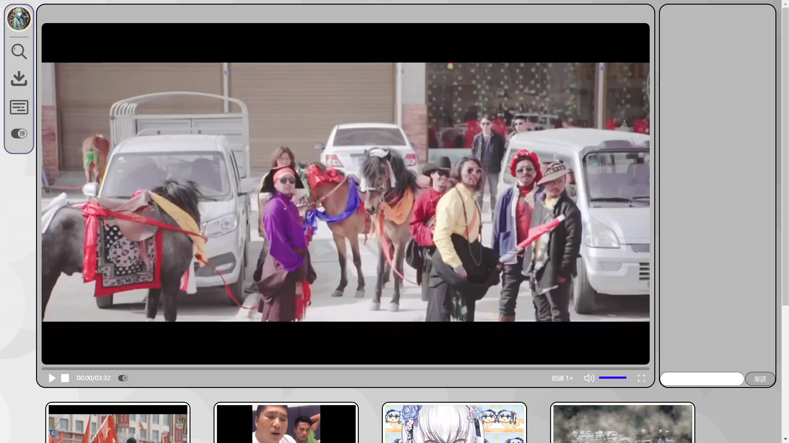

# FUCKbilibili

## 该项目包含一个网页和一个网页插件

### 网页部分：

​	

* 网页支持自动缩放，播放器部分和下方视频集会随着浏览器窗口大小改变而随之缩放

* 左侧导航栏：目前仅支持下载和弹幕开关功能（历史遗留问题），搜索功能未实现（我是傻逼）。弹幕发送功能在右侧视频播放器区域实现。鼠标移动其上会伸缩。
* 播放器：左侧是视频播放窗口，右侧是弹幕区域，所有控件均实现了对应功能。
* 视频集：下方可以自由选择视频播放，点击即可切换，目前共有六个视频可供选择。

## 插件

> ​	*有一种初生的美，有一种野性的美。*

​	使用最简单的方式实现最操蛋的功能——我是傻逼。

​	修改倍速后选择原始页面“2.0x”位置即可改变倍速。

## 开发历程

> 我是傻逼

​	第一周因为出车祸摆烂一周，第二周开始疯狂赶进度，先是比着视频学习了两三天html css，然后发现时间根本不够，开始转变策略为对点训练：找到已经实现具体功能的教程然后照虎画猫。

​	一开始已经实现了左侧导航条和一个基础的播放器和下方的视频集。然后要加弹幕功能时发现我是傻逼，我写的屎山我不想触碰。

​	于是就开始大重构工程，把整个播放器重构了一遍，才实现的，这导致之前的几坨屎山跟新播放器衔接不好，有点割裂感，但我也没时间修补了。

​	至于插件，网上的教程实在太少，几乎找不到具体实现案例教程，于是我作为天字第一号大傻逼选择了最野性的方式，最初生的方式来实现。效果只能说是狗屁不通，充满了赶作业的美。而且那东西是一次性的，几乎没法实用。
